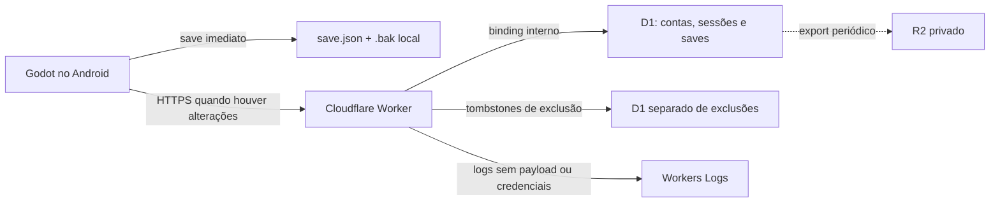
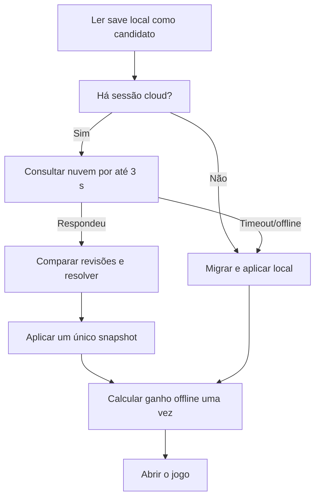

# Plano de save online — Cloudflare Worker + D1

**Projeto:** Maná Idle  
**Data da decisão:** 15 de julho de 2026  
**Estado do jogo:** Godot 4.7, save local JSON v8, offline-first  
**Objetivo:** oferecer recuperação e sincronização do progresso antes da Google Play, sem transações financeiras, preservando o funcionamento offline.

## 1. Decisão executiva

O projeto usará:

- um único Cloudflare Worker em TypeScript com Hono;
- Cloudflare D1 como banco principal do save;
- bancos D1 isolados por ambiente: principal e registro mínimo de exclusões;
- save local como primeira camada e fonte de recuperação durante falhas;
- conta anônima recuperável por código, sem exigir e-mail;
- revisão otimista para impedir que dois aparelhos sobrescrevam progresso silenciosamente;
- Workers Free + D1 Free no desenvolvimento e alpha fechada;
- Workers Paid, a partir de US$ 5/mês, antes de prometer o save online numa beta pública;
- PostgreSQL da VPS fora desta primeira versão.

Não haverá compra, PIX, checkout, doação, assinatura nem Play Billing antes da publicação na Google Play. O backend será usado apenas para conta, save, segurança e, se adotada a opção recomendada, uma carteira de **gemas gratuitas** sem valor financeiro.

### O que a Google Play muda — e o que ela não muda

A Google Play distribuirá e atualizará o aplicativo, mas não hospedará esta API nem o banco. Depois da entrada na loja, o Worker e o D1 continuarão necessários para:

- restaurar o progresso após reinstalação;
- sincronizar aparelhos;
- resolver conflitos;
- revogar dispositivos e excluir a conta;
- posteriormente validar compras e manter a carteira premium no servidor.

O Google Play Games poderá ser adicionado no futuro como uma identidade vinculada. Ele não substitui a API própria, porque o save já precisa funcionar antes da Play e porque compras futuras exigirão regras server-side.

## 2. Escopo da primeira entrega

### Incluído

- ativação opcional do save online;
- conta anônima chamada na interface de “Conta de Peregrino”;
- código de recuperação exibido uma vez;
- sessões independentes por aparelho;
- upload e download do snapshot inteiro;
- sincronização com revisão, checksum e idempotência;
- conflito explícito entre dois aparelhos;
- rotação do código de recuperação;
- listagem e revogação de aparelhos;
- exclusão da conta no app e por página web;
- logs, métricas, backup e ensaio de restauração;
- ambiente local, staging e produção;
- modo local funcional quando Worker ou D1 estiverem indisponíveis.

### Não incluído

- pagamentos ou produtos reais;
- anúncios reais;
- ranking competitivo;
- chat ou multiplayer;
- merge automático campo a campo;
- suporte humano que recupere uma conta sem credencial;
- PostgreSQL, Hyperdrive, KV, Durable Objects, Queues ou microserviços;
- dependência obrigatória do servidor para abrir o jogo.

## 3. Arquitetura alvo



Fluxo normal:

1. O jogo grava localmente como já faz hoje.
2. O `CloudSave` marca o estado como pendente, mas não cria uma requisição por gravação local.
3. Depois de um debounce, o app envia um snapshot compacto ao Worker.
4. O Worker autentica a sessão, valida o envelope e o save, calcula SHA-256 e atualiza a linha somente se a revisão ainda for a esperada.
5. O D1 devolve a nova revisão.
6. O app grava os metadados de sincronização separadamente do progresso.
7. Se a rede falhar, o save local permanece íntegro e o retry ocorre depois.

### Por que D1, e não PostgreSQL agora

D1 atende bem este primeiro modelo porque cada jogador possui uma linha pequena, as consultas são por chave, o volume inicial é baixo e a operação fica dentro do mesmo provedor do Worker. Isso evita manter API na VPS, porta de banco, TLS, patching, pool de conexões, failover e uma segunda infraestrutura de backup.

Cada banco D1 primário processa consultas de forma single-threaded. Por isso as operações serão curtas, indexadas e sem relatórios pesados no caminho do save. Read replication fica desativada inicialmente: revisão e conflito precisam de leitura consistente, e o MVP não tem carga que justifique essa complexidade.

Hono organiza rotas, middleware e erros; Zod valida somente envelopes e parâmetros. O payload do jogo usa um validador próprio com catálogos e cardinalidades do Maná Idle. O acesso ao D1 será SQL preparado direto, sem ORM.

O PostgreSQL da VPS só deve ser reavaliado se surgir pelo menos uma destas necessidades:

- consultas analíticas ou relacionais complexas;
- um domínio que já dependa fortemente do ecossistema PostgreSQL;
- tamanho ou taxa de escrita incompatíveis com o limite de um D1;
- necessidade concreta de portabilidade para infraestrutura própria;
- equipe preparada para operar disponibilidade, backups e restauração da VPS.

O APK nunca deve conectar diretamente à porta 5432.

## 4. Estado atual que precisa ser preservado

O projeto já possui:

- `user://save.json`, arquivo temporário e `.bak` local;
- autosave local a cada 10 segundos;
- `SAVE_VERSION = 8` e migrações de v1 até v8;
- gravações adicionais em pausa, fechamento e mudanças importantes;
- backup Android desativado, portanto a nuvem será a recuperação real após desinstalação.

O snapshot contém Fé, santos, relíquias, gemas, 36 geradores, upgrades, dádivas, estudo, passagens, aventuras, boosts e estatísticas. Um save quase completo medido ocupa aproximadamente 34,6 KiB em JSON compacto. A API adotará inicialmente:

- **64 KiB de limite para o payload do jogo**;
- 96 KiB de limite para o envelope HTTP que contém a string escapada;
- alerta operacional quando o p95 passar de 48 KiB;
- aumento para 128 KiB somente após medição e revisão;
- validação própria, embora o limite atual de uma linha do D1 seja 2 MB.

O Worker não aceitará automaticamente tudo que o loader local aceita hoje. IDs desconhecidos, arrays ilimitados, números negativos ou não finitos e versões futuras causam `422`; o servidor não remove nem corrige progresso silenciosamente. “Canonicalização” significa apenas serialização determinística sem mudar valores. Se algum dia houver transformação server-side, a resposta deverá devolver o payload resultante e o app só ficará sincronizado depois de validá-lo e persistir localmente.

## 5. Identidade e recuperação

### Experiência recomendada

1. O primeiro jogo continua local e não exige internet.
2. A tela inicial e as configurações oferecem “Ativar save online”.
3. Ao confirmar, o app cria uma conta anônima e envia o save local atual.
4. O app exibe um código de recuperação uma única vez, com botão para copiar e orientação clara para guardá-lo fora do aparelho.
5. O jogador confirma que guardou o código.
6. Em outro aparelho, “Recuperar save” cria uma nova sessão usando esse código.

### Credenciais

- `player_id`: UUID aleatório, identificador público pseudônimo.
- `device_id`: UUID emitido pelo servidor para cada instalação vinculada.
- `installation_id`: UUID local usado para reconhecer a instalação, sem usar IMEI, Android ID ou publicidade.
- código de recuperação: pelo menos 128 bits aleatórios, Crockford Base32, grupos legíveis e checksum.
- session token: 256 bits aleatórios, Base64URL, opaco e revogável.

O D1 guarda somente:

- `HMAC-SHA-256(RECOVERY_PEPPER, recovery_code)`;
- `HMAC-SHA-256(TOKEN_PEPPER, session_token)`.

Os peppers são secrets diferentes em staging e produção. Não entram no Git, no APK, no `wrangler.jsonc` nem nos logs.

Regras de sessão:

- validade por inatividade: 180 dias;
- limite absoluto: 365 dias;
- atualização de `last_seen_at` no máximo uma vez por dia; nessa escrita, estender `idle_expires_at` para `min(now + 180 dias, absolute_expires_at)`;
- recuperação cria nova sessão;
- usuário pode revogar um aparelho ou todos os outros;
- não usar JWT no MVP, pois token opaco é simples de revogar.

Recovery code e token carregam um prefixo público de versão, por exemplo `R1` e `S1`. O Worker usa esse `kid` para escolher o pepper correto. Durante rotação de secrets, a versão antiga continua apenas para verificação por uma janela documentada; toda nova credencial usa a versão atual. Depois da janela, sessões antigas são renovadas ou encerradas de forma explícita.

No Android, a meta é guardar o token no Keystore. Enquanto a integração segura do Godot não estiver pronta, `user://cloud_auth.json` no sandbox privado, com backup Android desativado, pode ser usado apenas na alpha. O código de recuperação não fica salvo em texto puro pelo jogo.

Limitação que a interface deve explicar: uma sessão ainda autenticada pode rotacionar um código perdido; nesse caso, as outras sessões são revogadas por segurança. Sem e-mail ou identidade externa, perder ao mesmo tempo todos os aparelhos autenticados e o código significa perder o acesso à conta. O suporte não deve entregar a conta com base em alegações do usuário.

## 6. Contrato da API v1

Base de produção: `https://api.manaidle.com/v1` — substituir pelo domínio real antes de configurar DNS.

Todas as respostas incluem `X-Request-Id`. Respostas com save usam `Cache-Control: no-store`. Erros seguem o mesmo envelope:

```json
{
  "error": {
    "code": "SAVE_CONFLICT",
    "message": "O save da nuvem mudou em outro aparelho.",
    "requestId": "uuid"
  }
}
```

### Identidade

| Método e rota | Autenticação | Finalidade |
|---|---|---|
| `POST /players` | Não | Criar conta, aparelho, sessão e save vazio |
| `POST /sessions/recover` | Código | Vincular instalação a uma conta existente |
| `POST /sessions/logout` | Bearer | Revogar a sessão atual |
| `GET /devices` | Bearer | Listar aparelhos da conta |
| `DELETE /devices/:id` | Bearer | Revogar o aparelho e todas as sessões dele |
| `POST /recovery-code/rotate` | Bearer + código atual | Emitir código novo e invalidar o anterior imediatamente |
| `POST /security/recovery-reset` | Bearer | Se o código foi perdido, iniciar reset de alta segurança com espera de 24 h |
| `DELETE /account` | Bearer + código + confirmação | Excluir imediatamente; sem código, iniciar exclusão atrasada e cancelável |

`POST /players` não terá retry automático cego. Se a resposta se perder antes de o app guardar a sessão, a conta vazia abandonada não contém o save; um processo de limpeza poderá remover contas vazias e inativas. O upload do primeiro progresso ocorre somente depois que a credencial foi persistida no aparelho.

### Save

| Método e rota | Condição | Resultado |
|---|---|---|
| `GET /save` | `If-None-Match` opcional | `200` com snapshot ou `304` sem alteração |
| `PUT /save` | `If-Match: "save-N"` obrigatório | Nova revisão ou conflito |
| `POST /save/restore-previous` | `If-Match` obrigatório | Restaura a cópia anterior como nova revisão |

Envelope de escrita:

```json
{
  "mutationId": "uuid",
  "schemaVersion": 8,
  "clientSavedAt": 1770000000,
  "resolution": "normal",
  "payloadSha256": "hex-do-payloadJson",
  "payloadJson": "{\"version\":8}"
}
```

Resposta de sucesso:

```json
{
  "mutationId": "uuid",
  "revision": 43,
  "etag": "\"save-43\"",
  "sha256": "hex",
  "serverUpdatedAt": 1770000005,
  "serverNow": 1770000005
}
```

`payloadJson` é o JSON compacto exato produzido pelo Godot, enviado como string dentro do envelope. O limite de 64 KiB é medido em seus bytes UTF-8; o envelope tem limite maior separado. O Worker recalcula SHA-256 sobre esses mesmos bytes, compara com `payloadSha256`, faz parse/validação e guarda a string validada. `GET /save` devolve a mesma `payloadJson`, permitindo verificar o checksum antes de aplicar. Assim não dependemos de TypeScript e GDScript serializarem floats e ordem de chaves da mesma forma.

Status relevantes:

- `400`: JSON ou parâmetros inválidos;
- `401`: sessão inválida, expirada ou revogada;
- `413`: payload excedeu o limite;
- `415`: `Content-Type` incorreto;
- `422`: versão, estrutura ou valor de save inválido;
- `428`: `If-Match` ausente;
- `412 SAVE_CONFLICT`: a revisão remota mudou;
- `429`: limite de abuso;
- `503`: D1 indisponível, sobrecarregado ou quota esgotada.

Uma conta recém-criada tem `revision = 0` e payload nulo. Nesse estado, `GET /save` responde `200` com `hasPayload: false`, nunca `404`; o primeiro `PUT` usa `If-Match: "save-0"`.

Se o jogador perdeu o recovery code mas ainda possui uma sessão válida, `POST /security/recovery-reset` cria uma solicitação pendente visível em todos os aparelhos. Após 24 horas, o aparelho iniciador pode concluir a rotação; todas as outras sessões são revogadas. Qualquer sessão existente pode cancelar durante a espera. A exclusão sem recovery code usa fluxo equivalente, com sete dias de espera. Isso preserva recuperação e direito de exclusão sem permitir tomada ou destruição imediata com um token recém-roubado.

## 7. Esquema D1

### Banco principal por ambiente

Tabelas iniciais:

- `players`: conta e hash do código de recuperação;
- `devices`: instalações vinculadas e revogação;
- `sessions`: hashes dos tokens, validade e revogação;
- `cloud_saves`: snapshot atual, revisão e cópia anterior;
- `save_mutations`: janela curta de idempotência para retries;
- `save_snapshots`: apenas marcos e resoluções explícitas, com retenção curta;
- `security_actions`: resets e exclusões atrasados/canceláveis;
- `d1_migrations`: criada/gerida pelo Wrangler.

Estrutura conceitual:

```sql
PRAGMA foreign_keys = ON;

CREATE TABLE players (
  id TEXT PRIMARY KEY,
  recovery_hash TEXT NOT NULL UNIQUE,
  recovery_key_version INTEGER NOT NULL DEFAULT 1,
  status TEXT NOT NULL DEFAULT 'active'
    CHECK(status IN ('active', 'deleting')),
  created_at INTEGER NOT NULL,
  recovery_rotated_at INTEGER,
  deletion_requested_at INTEGER
) STRICT;

CREATE TABLE devices (
  id TEXT PRIMARY KEY,
  player_id TEXT NOT NULL REFERENCES players(id) ON DELETE CASCADE,
  installation_id TEXT NOT NULL,
  label TEXT,
  created_at INTEGER NOT NULL,
  last_seen_at INTEGER NOT NULL,
  revoked_at INTEGER,
  UNIQUE(player_id, installation_id)
) STRICT;

CREATE TABLE sessions (
  id TEXT PRIMARY KEY,
  player_id TEXT NOT NULL REFERENCES players(id) ON DELETE CASCADE,
  device_id TEXT NOT NULL REFERENCES devices(id) ON DELETE CASCADE,
  token_hash TEXT NOT NULL UNIQUE,
  token_key_version INTEGER NOT NULL DEFAULT 1,
  created_at INTEGER NOT NULL,
  last_seen_at INTEGER NOT NULL,
  idle_expires_at INTEGER NOT NULL,
  absolute_expires_at INTEGER NOT NULL,
  revoked_at INTEGER
) STRICT;

CREATE TABLE cloud_saves (
  player_id TEXT PRIMARY KEY REFERENCES players(id) ON DELETE CASCADE,
  revision INTEGER NOT NULL DEFAULT 0 CHECK(revision >= 0),
  schema_version INTEGER,
  payload_json TEXT CHECK(payload_json IS NULL OR json_valid(payload_json)),
  payload_sha256 TEXT,
  payload_bytes INTEGER
    CHECK(payload_bytes IS NULL OR payload_bytes BETWEEN 1 AND 65536),
  previous_revision INTEGER,
  previous_schema_version INTEGER,
  previous_payload_json TEXT
    CHECK(previous_payload_json IS NULL OR json_valid(previous_payload_json)),
  previous_payload_sha256 TEXT,
  previous_updated_at INTEGER,
  last_mutation_id TEXT,
  last_device_id TEXT,
  client_saved_at INTEGER,
  created_at INTEGER NOT NULL,
  updated_at INTEGER
) STRICT;

CREATE TABLE save_mutations (
  player_id TEXT NOT NULL REFERENCES players(id) ON DELETE CASCADE,
  mutation_id TEXT NOT NULL,
  base_revision INTEGER NOT NULL,
  resulting_revision INTEGER NOT NULL,
  payload_sha256 TEXT NOT NULL,
  device_id TEXT NOT NULL,
  server_updated_at INTEGER NOT NULL,
  created_at INTEGER NOT NULL,
  PRIMARY KEY(player_id, mutation_id)
) STRICT, WITHOUT ROWID;

CREATE TABLE save_snapshots (
  id INTEGER PRIMARY KEY AUTOINCREMENT,
  player_id TEXT NOT NULL REFERENCES players(id) ON DELETE CASCADE,
  revision INTEGER NOT NULL,
  reason TEXT NOT NULL CHECK(length(reason) BETWEEN 1 AND 40),
  schema_version INTEGER NOT NULL,
  payload_json TEXT NOT NULL CHECK(json_valid(payload_json)),
  payload_sha256 TEXT NOT NULL,
  payload_bytes INTEGER NOT NULL CHECK(payload_bytes BETWEEN 1 AND 65536),
  created_at INTEGER NOT NULL,
  UNIQUE(player_id, revision, reason)
) STRICT;

CREATE TABLE security_actions (
  id TEXT PRIMARY KEY,
  player_id TEXT NOT NULL REFERENCES players(id) ON DELETE CASCADE,
  kind TEXT NOT NULL CHECK(kind IN ('recovery_reset', 'account_delete')),
  status TEXT NOT NULL CHECK(status IN ('pending', 'cancelled', 'completed')),
  requested_by_device_id TEXT NOT NULL,
  execute_after INTEGER NOT NULL,
  created_at INTEGER NOT NULL,
  cancelled_at INTEGER,
  completed_at INTEGER
) STRICT;
```

Índices obrigatórios:

- `sessions(token_hash)` único;
- `sessions(player_id, revoked_at, idle_expires_at)`;
- `devices(player_id)`;
- `save_mutations(created_at)` para limpeza da janela de idempotência;
- `save_snapshots(player_id, created_at)`;
- `security_actions(status, execute_after)` para concluir ações atrasadas.

O snapshot anterior fica na própria linha para permitir um undo curto sem uma inserção extra em toda sincronização. `save_snapshots` recebe somente marcos importantes e cópias explicitamente solicitadas; o servidor mantém no máximo cinco por conta e remove os mais antigos. A resolução “manter este aparelho” preserva o remoto nas colunas `previous_*` do mesmo `UPDATE` condicional; não depende de um `INSERT` separado para ser segura.

`save_mutations` retém operações por sete dias. Retry dentro dessa janela recebe exatamente a revisão e o hash já confirmados, mesmo que gravações posteriores tenham ocorrido. A limpeza é assíncrona e nunca remove uma operação ainda em voo no cliente.

### Registro separado de exclusões

Produção terá um segundo D1 pequeno, fora do banco restaurado, contendo somente:

- HMAC irreversível do `player_id`;
- instante da exclusão;
- instante de expiração do tombstone;
- estado de reaplicação em restauração.

```sql
CREATE TABLE deletion_tombstones (
  player_hmac TEXT PRIMARY KEY,
  status TEXT NOT NULL CHECK(status IN ('pending', 'completed')),
  requested_at INTEGER NOT NULL,
  completed_at INTEGER,
  expires_at INTEGER NOT NULL,
  last_error_code TEXT
) STRICT;

CREATE INDEX deletion_tombstones_pending_idx
  ON deletion_tombstones(status, requested_at);
```

Retenção recomendada: 45 dias, desde que todos os exports recuperáveis também expirem em 30 dias. A regra real é: tombstone nunca expira antes do backup mais antigo que ainda pode ser restaurado, mais sete dias de margem. Isso impede que uma restauração global ressuscite uma conta excluída. A política de privacidade deve explicar essa retenção operacional mínima.

A exclusão entre dois D1 não é uma transação. O fluxo seguro e idempotente é:

1. gravar primeiro o tombstone no banco de exclusões com estado `pending`;
2. marcar `players.status = 'deleting'` e bloquear autenticação/uploads;
3. excluir `players` no banco principal, usando cascades;
4. confirmar que a conta não existe mais;
5. marcar o tombstone `completed` e somente então retornar `204`.

Se o Worker cair entre etapas, uma rotina retoma tombstones pendentes. O usuário nunca recebe confirmação antes da conclusão.

### Migrations

```text
main/0001_identity_and_cloud_saves.sql
main/0002_idempotency_and_snapshots.sql
main/0003_deletion_workflow.sql
main/0004_free_wallet.sql          # somente se a decisão da seção 11 for adotada
deletions/0001_tombstones.sql
```

Regras:

- nunca editar uma migration já aplicada;
- testar local, staging e só depois produção;
- mudanças expand/contract, compatíveis com a versão anterior do Worker;
- bookmark/export antes de mudança destrutiva;
- nenhuma escrita dupla D1/PostgreSQL.

## 8. Concorrência e conflitos

O Worker fará compare-and-swap. Antes da escrita, consulta `save_mutations`; se o par `(player_id, mutation_id)` já existir, devolve a revisão e o hash originais. Para uma operação nova, um `batch()` transacional primeiro reserva a mutação somente se a revisão-base ainda existir e depois executa o update condicional. Se houver colisão de chave, o batch reverte e o Worker consulta a operação já concluída.

Primeira instrução do batch:

```sql
INSERT INTO save_mutations (
  player_id, mutation_id, base_revision, resulting_revision,
  payload_sha256, device_id, server_updated_at, created_at
)
SELECT player_id, ?, ?, revision + 1, ?, ?, unixepoch(), unixepoch()
FROM cloud_saves
WHERE player_id = ?
  AND revision = ?
  AND (schema_version IS NULL OR schema_version <= ?);
```

O Worker só confirma quando essa instrução e o update abaixo afetarem exatamente uma linha cada. Zero linhas significa precondição/schema divergente; erro de unicidade significa retry e provoca consulta da resposta gravada.

Se um `mutationId` existente vier com hash, revisão-base ou dispositivo diferentes, responder `422 MUTATION_REUSE_MISMATCH`; nunca tratar uma mutação alterada como retry válido.

O update completo é:

```sql
UPDATE cloud_saves
SET previous_revision = CASE
      WHEN payload_json IS NULL THEN NULL ELSE revision
    END,
    previous_schema_version = schema_version,
    previous_payload_json = payload_json,
    previous_payload_sha256 = payload_sha256,
    previous_updated_at = updated_at,
    revision = revision + 1,
    schema_version = ?,
    payload_json = ?,
    payload_sha256 = ?,
    payload_bytes = ?,
    last_mutation_id = ?,
    last_device_id = ?,
    client_saved_at = ?,
    updated_at = unixepoch()
WHERE player_id = ?
  AND revision = ?
  AND (schema_version IS NULL OR schema_version <= ?)
RETURNING revision, payload_sha256, updated_at;
```

Se nenhuma linha for atualizada:

1. consultar `save_mutations` para detectar retry concluído;
2. consultar revisão e schema atuais;
3. se o cliente tentaria reduzir o schema, responder `422 SAVE_SCHEMA_TOO_OLD` e exigir atualização;
4. nos demais casos, responder `412 SAVE_CONFLICT` com metadados e snapshot remoto.

Uma tabela de operações é necessária porque `last_mutation_id` sozinho só reconheceria o retry enquanto nenhuma gravação posterior tivesse ocorrido. As linhas antigas são removidas após a janela de sete dias. Contar essa inserção adicional no orçamento de linhas escritas do D1.

### Matriz do cliente

| Estado local | Estado remoto | Ação |
|---|---|---|
| Limpo | Mesma revisão | Nada |
| Sujo | Mesma revisão | Upload condicional |
| Limpo | Revisão maior | Baixar e aplicar |
| Sujo | Revisão maior | Mostrar conflito |
| Sem rede | Qualquer | Continuar local e enfileirar |

Nunca usar “timestamp mais recente vence”. O relógio Android é manipulável. Também não usar soma, `max()` ou merge campo a campo: ressurreições, compras, recompensas e resets tornam esse merge incorreto e podem duplicar recursos.

O diálogo de conflito mostra resumos do aparelho e da nuvem:

- última sincronização do servidor;
- ressurreições;
- Fé histórica;
- santos e gerador mais avançado;
- estudos e aventuras concluídos;
- gemas, com aviso de que a carteira server-side prevalece quando existir.

Opções:

- “Usar save da nuvem”: preserva o candidato local em `user://cloud_conflicts/<id>.json`, imutável e separado do `.bak`, e aplica o remoto;
- “Manter este aparelho”: exige confirmação; o mesmo update condicional preserva o remoto em `previous_*` e grava o local contra a revisão atual;
- “Decidir depois”: continua local, mas pausa uploads para não agravar o conflito.

Não substituir silenciosamente o estado enquanto o jogador já está jogando.

## 9. Sincronização no Godot

### Novos componentes

```text
scripts/autoload/CloudIdentity.gd
scripts/autoload/CloudSave.gd
scripts/cloud/CloudApi.gd
scripts/cloud/SaveValidator.gd
scripts/ui/CloudSaveDialog.gd
scripts/ui/CloudConflictDialog.gd
```

Alterações principais:

- `SaveSystem.gd`: separar `save_local()`, `mark_dirty()` e `request_cloud_sync()`;
- `GameState.gd`: validador, serialização compacta determinística e rejeição de versões futuras;
- `EventBus.gd`: sinais `game_state_dirty`, `sync_state_changed` e `cloud_conflict_detected`;
- `Main.gd`: bootstrap com janela curta de consulta à nuvem e lifecycle sem espera bloqueante;
- `project.godot`: registrar autoloads e habilitar acesso à internet no Android.

### Bootstrap correto



Esse bootstrap exige refatoração: hoje `load_game()` já aplica ganho offline e sistemas como estudo podem iniciar mutações durante `_ready()`. A nova sequência deve:

1. suspender autosave, ticks de produção, mutações do estudo e marcação `dirty`;
2. ler local, `.tmp`, `.bak` e remoto como candidatos sem efeitos colaterais;
3. escolher exatamente um snapshot;
4. migrar, validar e aplicar uma única vez;
5. calcular ganho offline uma única vez;
6. gravar o resultado local e só então liberar sistemas/timers.

Cada bootstrap recebe um `bootstrapEpoch`. Callback remoto que chegar depois de o epoch ter sido encerrado não pode aplicar estado; se houver divergência, abre o fluxo de conflito.

Após recuperar uma conta em uma instalação nova, o app sempre executa `GET /save` antes de qualquer `PUT`. Se a instalação for realmente virgem, restaura a nuvem. Se já houver progresso local significativo, persiste os dois candidatos e exige escolha explícita; nunca presume revisão zero nem envia o local automaticamente.

### Cadência

O autosave local de 10 segundos permanece. Upload cloud ocorre apenas quando o estado estiver sujo:

- no bootstrap e no retorno ao app;
- após 2 minutos de debounce, respeitando intervalo mínimo;
- no máximo uma vez a cada 5 minutos durante atividade normal;
- imediatamente após ressurreição, conclusão de aventura, recompensa relevante ou alteração de conta;
- por “Sincronizar agora”;
- ao pausar, apenas como tentativa adicional.

Navegar por capítulo, produção normal e cada autosave local não iniciam upload próprio. O app nunca espera a rede para fechar.

Retry sugerido, com jitter:

```text
5 s → 15 s → 60 s → 5 min → 15 min (máximo)
```

Estados exibidos ao usuário:

- Sincronizado;
- Salvando na nuvem;
- Pendente;
- Sem conexão — salvo neste aparelho;
- Conflito;
- Sessão expirada;
- Erro temporário.

Metadados de sincronização ficam fora do snapshot do jogo:

```json
{
  "cloudRevision": 42,
  "lastSyncedSha256": "hex",
  "localChangeSeq": 127,
  "dirty": true,
  "inFlight": {
    "mutationId": "uuid",
    "baseRevision": 42,
    "payloadSha256": "hex",
    "payloadFile": "user://cloud_pending/uuid.json"
  }
}
```

### Protocolo crash-safe do cliente

1. Todo commit local grava `save.json` atomicamente, gera o `payloadJson` compacto, calcula seu hash e incrementa `localChangeSeq` se o conteúdo mudou. Os sinais do `EventBus` servem para prioridade, não como única forma de detectar dirty.
2. Antes do HTTP, persistir atomicamente em `.tmp/.bak` o `sync_meta.json` e o corpo exato em `cloud_pending/<mutationId>.json`.
3. Retry, inclusive após reiniciar o app, reutiliza o mesmo `mutationId`, revisão-base e bytes do payload.
4. Quando chega `2xx`, confirmar `mutationId`, revisão e SHA esperados. Avançar `cloudRevision` e `lastSyncedSha256`; limpar `dirty` somente se o hash atual ainda for igual ao hash confirmado. Se o jogo mudou durante a requisição, manter dirty e enviar a próxima revisão depois.
5. No startup, não confiar apenas no booleano persistido: ler `save.json`, regenerar o `payloadJson` compacto, comparar seu hash com `lastSyncedSha256` e reconstruir dirty.
6. `save_game()` passa a retornar sucesso/erro e verifica abertura, flush, cópia e rename. Um download só vira revisão local depois de validar schema/SHA, gravar atomicamente e reler com sucesso.
7. `401`, `412`, `413`, `422`, `429` e `5xx` nunca limpam o pendente. Cada um segue seu fluxo de autenticação, conflito, correção ou retry.
8. Conflito não resolvido e seus dois candidatos ficam em arquivos imutáveis de `user://cloud_conflicts/`; o autosave de 10 segundos não pode sobrescrevê-los.

Fluxos que hoje salvam no meio de uma recompensa ou ativação de boost devem virar uma transação de domínio: suspender upload, executar consumo + concessão, persistir o estado final e só então liberar sync. Nenhum snapshot intermediário pode subir.

### Relógio e ganho offline

Hoje `lastSeen`, boosts e recompensas dependem do relógio do aparelho. Para o cloud save:

- o Worker devolve `serverNow` e mantém `serverUpdatedAt`;
- um snapshot baixado usa o horário do servidor como referência de ausência;
- o ganho offline é calculado apenas uma vez durante o bootstrap;
- intervalos recebem teto de plausibilidade;
- recompensas temporizadas que afetarem a futura carteira usam horário do servidor.

O MVP ainda não torna toda a produção do jogo server-authoritative. Portanto, o progresso comum continua editável por um cliente modificado e não pode alimentar ranking competitivo ou valor financeiro.

## 10. Validação e segurança

### Validação do save

- `schemaVersion === JSON.parse(payloadJson).version`;
- o app aceita saves locais v1–v8, migra para v8 e somente então envia;
- o `PUT` aceita apenas v8 no lançamento; numa futura v9, a API mantém v8 e v9 durante o rollout;
- rejeitar `version > 8` até a API ser atualizada;
- geradores somente de 1 a 36;
- IDs conhecidos para upgrades, dádivas, boosts, conhecimentos e aventuras;
- arrays sem duplicatas e com cardinalidade máxima;
- strings com comprimento máximo;
- números finitos, inteiros quando exigidos e não negativos;
- profundidade JSON limitada;
- corpo compacto até 64 KiB;
- SHA-256 sempre calculado pelo servidor.

Para compatibilidade, o Worker deve aceitar o envelope das versões antigas ainda suportadas pelo aplicativo anterior durante rollout. Migration de save ocorre em função pura e tem testes de fixture para cada v1→v8.

### Proteções da API

- somente HTTPS em domínio próprio;
- prepared statements em todas as consultas;
- nenhum segredo comum embutido no APK;
- token opaco por instalação;
- middleware autentica com join de `sessions`, `devices` e `players`, exigindo sessão ativa, dispositivo não revogado e `players.status = 'active'`;
- revogar dispositivo e todas as sessões dele no mesmo batch do banco principal;
- rate limit por jogador e rota autenticada;
- IP apenas como barreira secundária em criação e recuperação;
- CORS fechado para o app nativo; origem explícita apenas na página de exclusão;
- `Content-Type`, tamanho e tempo de processamento limitados;
- mensagens de recovery inválido sem revelar se a conta existe;
- sem payload, token, código ou `Authorization` em logs;
- IDs pseudonimizados nos eventos de observabilidade.

Limites iniciais:

| Rota | Chave principal | Limite |
|---|---|---:|
| Criar conta | installation hash + IP secundário | 2/min + 5/min |
| Recuperar | recovery hash + IP secundário | 5/min + 20/min |
| GET save | player | 30/min |
| PUT save | player | 12/min |
| Rotar/excluir | player | 3/min |

O binding de Rate Limiting da Cloudflare é local por datacenter e eventualmente consistente. Ele serve para reduzir abuso, não para dinheiro, quotas exatas ou regras da economia. Janelas maiores que 60 segundos exigem contador próprio ou WAF.

Antes de qualquer distribuição pública, remover credenciais de assinatura atualmente expostas no preset local, rotacionar o que for necessário e guardar secrets fora do repositório. Nenhum valor de senha deve aparecer em documentação ou logs.

## 11. Gemas: decisão antes do APK público

O save atual inclui `gemas`, `gemasTotal`, inventário de boosts e desbloqueios. Como o JSON local é editável, uma pessoa pode alterar o saldo e enviá-lo à nuvem. Isso não causa prejuízo financeiro durante a alpha, mas cria uma migração perigosa quando gemas passarem a ser vendidas.

### Caminho recomendado

Tornar as **gemas gratuitas** server-authoritative antes do APK público, ainda sem qualquer pagamento:

- `wallets`: saldos gratuitos e revisão;
- `wallet_entries`: ledger imutável com `operation_id` único;
- `entitlements`: boosts e desbloqueios comprados com gemas;
- endpoints de reivindicação e gasto idempotentes;
- saldo no JSON local apenas como cache;
- recompensa gratuita offline fica pendente para validação online;
- gasto de gemas exige conexão;
- relógio e limites de recompensa vêm do servidor.

Cloud save continua opt-in para o progresso comum, mas isso cria uma fronteira explícita:

- sem Conta de Peregrino, o jogo-base continua offline e o saldo de gemas é apenas local, não recuperável e nunca será importado como saldo pago;
- ao ativar a conta, uma única migração gratuita e limitada pode criar a carteira; depois disso, reivindicar ou gastar gemas nessa conta exige o servidor;
- antes de qualquer compra real, a identidade cloud será obrigatória para a economia de gemas; saldo puramente local fica fora da carteira paga;
- a interface deve explicar essa diferença antes da ativação.

`operation_id` evita repetir a mesma requisição, mas não impede o cliente de criar outro UUID para a mesma recompensa. Toda concessão usa também um `grant_key` determinado ou validado pelo servidor, com unicidade por jogador. Exemplos: `daily:2026-07-15`, `adventure:<id>:first`, `reward-window:<id>:slot:<n>` e `migration:free-v1`. O Worker valida elegibilidade e insere ledger + saldo atomicamente; não aceita um motivo ou valor arbitrário enviado pelo APK.

Exemplo de estrutura futura:

```sql
CREATE TABLE wallets (
  player_id TEXT PRIMARY KEY REFERENCES players(id) ON DELETE CASCADE,
  free_balance INTEGER NOT NULL DEFAULT 0,
  paid_balance INTEGER NOT NULL DEFAULT 0,
  revision INTEGER NOT NULL DEFAULT 0
) STRICT;

CREATE TABLE wallet_entries (
  id TEXT PRIMARY KEY,
  player_id TEXT NOT NULL REFERENCES players(id) ON DELETE CASCADE,
  operation_id TEXT NOT NULL,
  grant_key TEXT,
  bucket TEXT NOT NULL CHECK(bucket IN ('free', 'paid')),
  amount INTEGER NOT NULL,
  reason TEXT NOT NULL,
  source_ref TEXT,
  created_at INTEGER NOT NULL,
  UNIQUE(player_id, operation_id)
) STRICT;

CREATE UNIQUE INDEX wallet_grant_unique
  ON wallet_entries(player_id, grant_key)
  WHERE grant_key IS NOT NULL;
```

Antes da Play, `paid_balance` fica sempre zero e não existe endpoint de compra. Quando Billing entrar, recibos e `purchase_token` único serão adicionados em outra migration; o JSON nunca poderá creditar saldo pago.

### Atalho permitido apenas para alpha fechada

É possível lançar a primeira alpha com gemas client-authoritative, desde que:

- ela seja marcada claramente como progresso de teste;
- não haja ranking ou troca entre usuários;
- nenhum saldo seja prometido como transferível para a economia paga;
- seja definida uma data de corte;
- a importação para a futura carteira ocorra uma única vez, com teto e validação de plausibilidade;
- o servidor nunca reimporte repetidamente o campo `gemas`.

Este atalho reduz o trabalho inicial, mas não é a recomendação para o APK público.

## 12. Privacidade, exclusão e Google Play

Uma identidade anônima recuperável entre aparelhos deve ser tratada prudentemente como conta. Implementar antes da beta pública:

- “Apagar progresso deste aparelho”: remove apenas arquivos e sessão locais;
- “Excluir conta e save da nuvem”: revoga sessões e apaga conta, saves, snapshots e dispositivos;
- página web pública de exclusão para quem não possui mais o app;
- autenticação da página por recovery code e proteção antiabuso;
- prazo e justificativa para tombstones e backups;
- procedimento para reaplicar exclusões depois de restauração.

O save contém progresso de estudo e a última passagem bíblica. Associado a uma identidade persistente, isso pode permitir inferências sobre convicção religiosa, que merece tratamento de dado sensível e minimização. Não coletar texto livre, oração, denominação ou declaração de fé sem análise específica.

Antes da primeira alpha com usuários reais:

- revisar política de privacidade e base legal;
- documentar Cloudflare como operador;
- documentar transferência internacional e retenção;
- definir contato do controlador;
- cobrir acesso, correção, portabilidade e exclusão;
- preencher Data Safety com User ID e atividade do app, finalidade de funcionalidade/conta e coleta opcional se o cloud for opt-in;
- manter criptografia em trânsito;
- revisar juridicamente o dado de estudo religioso e a transferência internacional.

O D1 não oferece atualmente um location hint primário na América do Sul. Usar localização automática, não fingir residência local, e registrar essa decisão na documentação de privacidade.

## 13. Ambientes e estrutura do repositório

```text
backend/cloud-save/
├─ package.json
├─ tsconfig.json
├─ wrangler.jsonc
├─ migrations/
│  ├─ main/
│  │  ├─ 0001_identity_and_cloud_saves.sql
│  │  ├─ 0002_idempotency_and_snapshots.sql
│  │  └─ 0003_deletion_workflow.sql
│  └─ deletions/
│     └─ 0001_tombstones.sql
├─ src/
│  ├─ index.ts
│  ├─ env.ts
│  ├─ middleware/auth.ts
│  ├─ middleware/errors.ts
│  ├─ routes/players.ts
│  ├─ routes/sessions.ts
│  ├─ routes/saves.ts
│  ├─ routes/devices.ts
│  ├─ routes/deletion.ts
│  ├─ db/
│  ├─ security/
│  └─ validation/
└─ test/
   ├─ unit/
   ├─ integration/
   └─ fixtures/saves-v1-v8/
```

Ambientes:

| Ambiente | Worker | D1 | Finalidade |
|---|---|---|---|
| Local | Miniflare/Wrangler | D1 local persistido | Desenvolvimento e testes |
| Staging | `mana-save-staging` | `mana-save-staging` + `mana-delete-staging` | APK interno sem dados reais |
| Produção | `mana-save-prod` | `mana-save-prod` + `mana-delete-prod` | Alpha/beta e produção |

Cada ambiente recebe peppers, rate-limit namespace, domínio e banco próprios. Bindings de ambiente devem ser declarados explicitamente; staging nunca recebe cópia automática de dados reais.

Um handler agendado diário, idempotente, conclui exclusões pendentes, limpa `save_mutations` vencidas, limita snapshots a cinco e remove tombstones somente após a retenção. Isso não exige Queue nem outro serviço.

CI mínima:

- format/lint;
- TypeScript typecheck;
- testes unitários;
- integração com D1 local;
- aplicar migrations em banco vazio e em fixture da versão anterior;
- smoke test no staging;
- checagem de secrets e dependências;
- build Android de integração.

## 14. Observabilidade, backup e operação

### Logs e métricas

Registrar:

- request ID, rota, status e duração;
- tamanho do payload;
- revisão anterior e nova;
- conflito, validação, rate limit e erro D1;
- contagem de linhas lidas/escritas;
- player ID pseudonimizado.

Nunca registrar payload, código de recuperação, session token, cabeçalho `Authorization`, IP completo ou detalhes de estudo.

Painel mínimo:

- taxa de sucesso de sync;
- p50/p95 de latência;
- 4xx, 5xx, `412` e `429`;
- sessões expiradas;
- tamanho p50/p95/máximo do save;
- consumo diário do Worker e D1;
- armazenamento D1;
- idade do último export e do último restore drill.

Alertas:

- 5xx acima de 1% por 10 minutos;
- sync abaixo de 99,5%, desconsiderando ausência real de rede;
- crescimento anormal de `412`, `429` ou falhas de recovery;
- quota, sobrecarga ou armazenamento acima de 70%;
- backup/export atrasado;
- exclusão pendente ou falha ao reaplicar tombstone.

### Backup

- Time Travel do D1 sempre ativo: 7 dias no Free e 30 dias no Paid;
- bookmark/export antes de migrations de risco;
- export semanal para R2 privado após o início da beta, com lifecycle de 30 dias;
- export fora do horário de pico, pois exportação pode bloquear requisições do banco;
- opcionalmente uma cópia criptografada na VPS para reduzir dependência de provedor, também limitada a 30 dias;
- ensaio trimestral de restauração em banco isolado;
- documentar quem pode restaurar e como validar contagem, checksum e exclusões.

O Time Travel restaura o banco de produção no lugar; não cria automaticamente um clone. Em incidente real, o runbook deve colocar todas as rotas cloud em manutenção, bloquear autenticação e uploads, executar o restore, reaplicar todos os tombstones ainda válidos, validar contagens/checksums e somente então reabrir. O jogo continua salvando localmente durante a janela. Nunca expor por alguns minutos um banco restaurado antes de reaplicar exclusões.

## 15. Implantação segura

1. Deploy local e testes completos.
2. Deploy em staging com APK interno.
3. Migration de produção antes do código que a utiliza, usando expand/contract.
4. Deploy de versão do Worker compatível com clientes antigos.
5. Alpha para equipe e 20–50 pessoas.
6. Corrigir falhas e ensaiar rollback.
7. Ativar Workers Paid.
8. Rollout gradual do Worker em 10%, 50% e 100%.
9. Beta do APK para 100–300 pessoas.
10. Observar pelo menos sete dias sem perda silenciosa.
11. Publicar o APK amplamente.

O Worker terá uma chave operacional para:

- impedir novas contas;
- colocar upload temporariamente em read-only;
- manter download e recuperação ativos;
- exigir versão mínima do cliente somente quando realmente necessário.

Rollbacks do Worker não devem depender de desfazer migration. Toda API v1 permanece retrocompatível durante rollout; mudanças incompatíveis entram em `/v2`.

## 16. Passo a passo de execução

### Passo 0 — congelar decisões de produto e privacidade

**O que fazer**

- confirmar domínio da API;
- confirmar que cloud save é opt-in e o jogo continua offline;
- aprovar a experiência do recovery code;
- escolher o caminho recomendado de gemas server-authoritative para o APK público;
- definir contato e responsável pela privacidade.

**Como fazer**

- registrar as decisões neste documento e nos wireframes;
- escrever textos de ativação, conflito, perda de código e exclusão;
- atualizar política de privacidade e inventário de dados.

**Saída:** escopo sem ambiguidades.  
**Tempo:** 1–2 dias.  
**Custo de infraestrutura:** R$ 0.

### Passo 1 — preparar Worker e ambientes

**O que fazer**

- criar `backend/cloud-save`;
- instalar Hono, Wrangler, TypeScript, Vitest e validação;
- criar configuração local/staging/prod;
- gerar tipos de bindings;
- definir domínio de staging.

**Como fazer**

- usar módulo Worker, handlers assíncronos e bindings tipados;
- manter secrets fora do Git;
- não ativar `nodejs_compat` sem dependência real que o exija;
- criar endpoint `/health` sem detalhes internos.

**Saída:** Worker vazio testado localmente e em staging.  
**Tempo:** 1 dia.  
**Custo:** R$ 0 no Free.

### Passo 2 — criar esquema e migrations D1

**O que fazer**

- implementar tabelas, índices, foreign keys e checks;
- criar D1 local e staging;
- testar banco vazio, upgrade e rollback de falha;
- documentar o plano de expansão.

**Como fazer**

- SQL preparado sem ORM;
- `STRICT`, `json_valid`, chaves estrangeiras e `ON DELETE CASCADE`;
- `batch()` para criação atômica de player/device/session/save;
- uma migration numerada por mudança.

**Saída:** banco reproduzível e testado.  
**Tempo:** 1–2 dias.  
**Custo:** R$ 0.

### Passo 3 — identidade, sessão e recuperação

**O que fazer**

- criar conta;
- emitir e verificar recovery code;
- autenticar bearer token;
- rotacionar código;
- listar/revogar aparelhos;
- aplicar rate limits.

**Como fazer**

- Web Crypto para aleatoriedade e HMAC;
- comparação de hashes em formato fixo;
- respostas de erro sem enumeração de conta;
- teste de token vencido, revogado e duplicado.

**Saída:** uma conta pode ser recuperada em segundo aparelho.  
**Tempo:** 2–3 dias.  
**Custo:** R$ 0.

### Passo 4 — GET/PUT, validação e conflito

**O que fazer**

- implementar ETag, `If-Match`, revisão e tabela de `mutationId`;
- validar uploads v8 e testar no Godot a migração local de v1–v8 antes do envio;
- guardar snapshot anterior;
- responder conflitos sem sobrescrever;
- criar fixtures malformadas.

**Como fazer**

- reserva idempotente + update condicional por `player_id + revision` no mesmo batch;
- rejeitar downgrade de schema por cliente antigo;
- checksum calculado pelo Worker;
- body limit antes de parse completo quando possível;
- testes concorrentes simulando aparelhos A e B.

**Saída:** API não perde progresso silenciosamente e retries são idempotentes.  
**Tempo:** 2–3 dias.  
**Custo:** R$ 0.

### Passo 5 — integrar Godot sem quebrar o save local

**O que fazer**

- adicionar identidade, cliente HTTP, estados e fila;
- refatorar SaveSystem para dirty/debounce;
- criar bootstrap sem efeitos colaterais, com epoch e timeout;
- persistir payload e metadados da mutação em voo;
- manter `.bak` e migrações locais;
- expor status e botão manual.

**Como fazer**

- uma única requisição por vez;
- recalcular dirty por hash e nunca limpar alteração mais nova com ACK antigo;
- usar diretório imutável separado para candidatos de conflito;
- timeout de cerca de 10 segundos nas requisições normais;
- no máximo um upload a cada 5 minutos em rotina;
- backoff com jitter;
- nunca aguardar upload no fechamento.

**Saída:** jogo funciona online e offline com sync pendente seguro.  
**Tempo:** 3–5 dias.  
**Custo:** R$ 0.

### Passo 6 — UX de conflito, recovery e exclusão

**O que fazer**

- criar diálogos e resumos;
- implementar cópia/rotação do código;
- implementar reset/exclusão atrasados quando o código foi perdido;
- separar wipe local de exclusão cloud;
- criar página web de exclusão;
- testar acessibilidade e textos de risco.

**Como fazer**

- confirmação dupla para overwrite e exclusão; ação de alta segurança sem código usa espera cancelável;
- preservar backup local antes de aplicar nuvem;
- recovery code + proteção antiabuso no fluxo web;
- não mostrar dados da conta antes da autenticação.

**Saída:** o usuário controla conflito, recuperação e eliminação.  
**Tempo:** 2–4 dias.  
**Custo:** Pages/Worker dentro do plano; revisão jurídica opcional.

### Passo 7 — separar gemas antes do APK público

**O que fazer**

- criar wallet e ledger gratuitos;
- transformar saldo local em cache;
- tornar cada reivindicação e gasto idempotente;
- migrar uma única vez o saldo de alpha com teto definido;
- manter `paid_balance = 0` e nenhum endpoint de compra.

**Como fazer**

- transação condicional de saldo + ledger;
- `operation_id` único para retry e `grant_key` server-side único para a recompensa;
- limites e relógio do servidor para recompensas;
- fila local apenas para reivindicações permitidas;
- testes de replay, dois aparelhos e saldo insuficiente.

**Saída:** economia gratuita pronta para receber Billing no futuro sem confiar no JSON.  
**Tempo:** 3–5 dias.  
**Custo:** sem taxa financeira; apenas uso normal de Worker/D1.

### Passo 8 — operação, backup e segurança

**O que fazer**

- ativar logs, métricas e alertas;
- criar tombstones de exclusão;
- configurar export privado;
- fazer restore drill;
- revisar secrets, assinatura Android e dependências.

**Como fazer**

- logs JSON sem payload;
- ensaiar em ambiente isolado e colocar produção em manutenção durante restore real;
- reaplicar tombstones antes de reabrir qualquer rota cloud;
- simular quota esgotada e D1 indisponível;
- documentar runbook e responsáveis.

**Saída:** backend operável, não apenas funcional.  
**Tempo:** 2–3 dias.  
**Custo:** ainda pode ficar no Free durante alpha.

### Passo 9 — alpha, plano pago e beta pública

**O que fazer**

- testar com 20–50 pessoas;
- corrigir perda, conflito e recovery;
- ativar Workers Paid;
- liberar para 100–300 pessoas;
- observar métricas e custos por sete dias.

**Como fazer**

- feature flag para desativar uploads;
- rollout gradual 10/50/100;
- suporte orientado por request ID;
- bloquear APK público se houver qualquer perda silenciosa.

**Saída:** save online pronto para acompanhar o APK público e depois a Play.  
**Tempo:** 2–3 semanas de teste, em paralelo às correções.  
**Custo:** US$ 5/mês antes da promessa pública.

## 17. Testes obrigatórios

### Save e rede

- primeira instalação online e offline;
- ativar nuvem depois de já existir progresso;
- app encerrado durante upload;
- alteração local nova enquanto um upload antigo está em voo;
- crash entre `save.json`, `sync_meta.json`, arquivo pendente e ACK;
- timeout, modo avião, troca Wi-Fi/4G e retorno;
- 5xx, `429`, `503` e quota simulada;
- retry com o mesmo `mutationId`;
- retry antigo depois de outra mutação já confirmada;
- falha de gravação/cópia/rename ao aplicar download;
- callback remoto atrasado depois de encerrado o `bootstrapEpoch`;
- nenhum snapshot intermediário durante recompensa ou boost;
- payload truncado, corrupto, grande, negativo ou adulterado;
- versão futura rejeitada;
- fixtures de todas as versões v1–v8;
- save quase completo com capítulos e marcadores máximos.

### Dois aparelhos

- A e B em sequência;
- A e B simultâneos;
- ambos offline e reconectando depois;
- “usar nuvem”, “manter aparelho” e “decidir depois”;
- conflito durante a resolução;
- persistência dos dois candidatos após fechar/reabrir o app;
- recovery em aparelho virgem e em aparelho com progresso local significativo;
- sessão revogada em um dos aparelhos;
- dispositivo revogado com sessão ainda não expirada;
- mesmo request enviado duas vezes.

### Tempo e lifecycle

- relógio adiantado e atrasado;
- troca de fuso;
- pausa e fechamento sem aguardar rede;
- processo morto pelo Android;
- ganho offline calculado uma vez;
- boosts e cooldowns com referência de servidor.

### Conta e privacidade

- recovery correto, incorreto, perdido, rotacionado e revogado;
- reset sem código com espera, cancelamento e revogação das demais sessões;
- reinstalação e migração APK direto → Google Play;
- exclusão dentro do app;
- exclusão pela web sem o app;
- falha entre tombstone, estado `deleting` e cascade, seguida de retry;
- restore do D1 sem ressuscitar conta excluída;
- Worker em manutenção durante todo o restore e reaplicação de tombstones;
- tentativa de acessar `player_id` de outra conta;
- logs sem token, recovery code ou conteúdo do save.

### Gemas, se a carteira recomendada for adotada

- reivindicação duplicada;
- novo `operation_id` tentando repetir o mesmo `grant_key`;
- replay após reinstalação;
- gasto simultâneo em A e B;
- saldo insuficiente;
- reward expirado;
- importação alpha executada uma única vez;
- `paid_balance` impossível de alterar antes da Play.

## 18. Critérios de liberação

O APK público só avança quando:

- não houver caso conhecido de perda silenciosa;
- ACK antigo nunca puder limpar uma alteração local mais nova;
- restart reutilizar exatamente a mutação em voo e reconstruir dirty pelo hash;
- modo local funcionar com Worker e D1 totalmente fora do ar;
- conflito nunca for resolvido automaticamente;
- taxa de sync for superior a 99,5%, excluindo ausência real de rede;
- recuperação em segundo aparelho estiver verificada;
- rotação e revogação de credenciais funcionarem;
- exclusão no app e na web estiverem verificadas;
- restore drill tiver sido executado e documentado;
- tombstones impedirem ressurreição de conta;
- restore permanecer fechado até tombstones serem reaplicados;
- logs não contiverem secrets nem payload;
- payload p95 e consumo D1 estiverem abaixo dos alertas;
- contas cloud usarem carteira de gemas server-authoritative e o saldo local-only estiver marcado como não transferível para a futura carteira paga;
- Workers Paid estiver ativo antes de o save ser prometido publicamente.

## 19. Custos esperados

Valores de plataforma conferidos em 15 de julho de 2026. A reserva em reais não é cotação.

| Item | Fase | Custo esperado |
|---|---|---:|
| Workers Free | Desenvolvimento/alpha | US$ 0; 100 mil requests/dia |
| D1 Free | Desenvolvimento/alpha | US$ 0; 5 milhões de linhas lidas/dia, 100 mil escritas/dia, 500 MB por banco |
| Workers Paid | Antes da beta pública | A partir de US$ 5/mês; reservar R$ 30–40/mês |
| D1 no plano Paid | Produção inicial | Incluído: 25 bilhões de linhas lidas/mês, 50 milhões escritas/mês e 5 GB |
| Excedente D1 | Escala | US$ 0,001 por milhão de leituras; US$ 1 por milhão de escritas; US$ 0,75/GB-mês |
| Workers Logs | Produção inicial | Paid inclui 20 milhões de eventos/mês e 7 dias; excedente de US$ 0,60/milhão |
| R2 privado para exports | Beta/produção | Provavelmente centavos ou free tier no volume inicial |
| Domínio | Produção | R$ 40–100/ano, se ainda não existir |
| VPS/PostgreSQL | MVP | R$ 0 adicional; não será usado |
| Revisão jurídica/privacidade | Pré-produção | Opcional, porém recomendada: aproximadamente R$ 500–3.000 |
| Engenharia própria | Implementação | Sem desembolso externo; 110–180 horas com carteira gratuita |

O Free tem limites diários rígidos; ao atingi-los, chamadas ao D1 falham até o reset. Como o jogo continua local, isso não apaga progresso, mas deixa a recuperação cloud temporariamente indisponível. Por isso o plano Paid entra antes da beta pública.

Estimativas de carga para acompanhar, não promessas de capacidade:

- 1.000 jogadores ativos × 10 uploads/dia ≈ 10 mil requisições de atualização/dia;
- 5.000 jogadores ativos × 10 uploads/dia ≈ 50 mil requisições de atualização/dia;
- sincronizar a cada 10 segundos seria 8.640 uploads por usuário/dia e é proibitivo;
- armazenamento depende mais do p95 do save e das cópias anteriores do que do número bruto de contas.

Requisições não equivalem a linhas escritas: cada PUT aceito atualiza `cloud_saves`, insere `save_mutations` e pode manter índices; sessões, snapshots, ledger e limpezas também escrevem. Dimensionar com `meta.rows_written` medido em staging, não apenas com a quantidade de uploads. Logs e traces devem usar amostragem consciente para permanecer dentro das cotas de observabilidade.

Gatilhos de ação:

- ativar Paid antes da beta pública;
- alertar a 70% das cotas ou armazenamento;
- revisar cadência quando o p95 passar de 48 KiB;
- reduzir snapshots antes de sharding;
- reavaliar arquitetura se um D1 se aproximar do limite de 10 GB no Paid ou apresentar contenção sustentada.

Referências oficiais: [Workers pricing](https://developers.cloudflare.com/workers/platform/pricing/), [D1 pricing](https://developers.cloudflare.com/d1/platform/pricing/), [limites do D1](https://developers.cloudflare.com/d1/platform/limits/) e [Workers Logs](https://developers.cloudflare.com/workers/observability/logs/workers-logs/).

## 20. Cronograma realista

### Cloud save principal

| Período | Resultado |
|---|---|
| Semana 1 | decisões, Worker, D1, migrations e identidade |
| Semana 2 | GET/PUT, validação, revisão, retry e integração Godot |
| Semana 3 | conflitos, recovery, dispositivos, exclusão e observabilidade |
| Semana 4 | carteira gratuita recomendada e hardening |
| Semana 5 | alpha fechada de 20–50 pessoas |
| Semanas 6–7 | beta de 100–300 pessoas, correções e ativação Paid |

Estimativa:

- cloud save sem carteira: 80–140 horas;
- cloud save com carteira gratuita: 110–180 horas;
- implementação: 3–5 semanas para uma pessoa;
- validação pública: mais 1–2 semanas de beta;
- prazo prudente total: 4–7 semanas.

Esse trabalho pode acontecer em paralelo ao preparo do APK, Pages/R2 e Play Console, mas o APK público não deve prometer save online antes dos critérios de liberação.

## 21. Checklist final de implementação

### Backend

- [ ] Worker TypeScript + Hono criado.
- [ ] D1 principal e de exclusões separados em local/staging/produção.
- [ ] Migrations testadas.
- [ ] Secrets fora do repositório.
- [ ] Sessões opacas e revogáveis.
- [ ] Recovery code rotacionável.
- [ ] GET/PUT com ETag, `If-Match` e tabela de `mutationId`.
- [ ] Upload v8 validado, migrações locais v1–v8 testadas e limite de 64 KiB.
- [ ] Cópia anterior e snapshots de marcos.
- [ ] Rate limits por ator.
- [ ] Exclusão e tombstones.
- [ ] Dispositivo revogado invalida todas as sessões dele.
- [ ] Logs e alertas sem dados sensíveis.
- [ ] Export e restore drill.

### Godot

- [ ] Save local continua funcionando sozinho.
- [ ] `CloudIdentity` e `CloudSave` adicionados.
- [ ] Token guardado com segurança.
- [ ] Dirty/debounce em vez de upload a cada autosave.
- [ ] Payload em voo persiste e é reutilizado depois de crash.
- [ ] ACK antigo não limpa mudança local nova.
- [ ] Bootstrap calcula ganho offline uma vez.
- [ ] Status de sync visível.
- [ ] Conflito exige escolha explícita.
- [ ] Candidatos de conflito ficam fora do `.bak` rotativo.
- [ ] Recovery e revogação de aparelhos funcionam.
- [ ] Wipe local separado de exclusão cloud.
- [ ] Permissão de internet verificada no APK.
- [ ] APK direto e versão Play preservam pacote e assinatura.

### Produto e operação

- [ ] Contas cloud usam carteira gratuita server-authoritative; saldo local-only não migra para saldo pago.
- [ ] Nenhuma transação financeira antes da Play.
- [ ] Política de privacidade atualizada.
- [ ] Página de exclusão pública.
- [ ] Data Safety preparado.
- [ ] Transferência internacional documentada.
- [ ] Plano Paid ativo antes da beta pública.
- [ ] Alpha e beta concluídas sem perda silenciosa.
- [ ] Runbook e responsáveis definidos.

## 22. Fontes oficiais

- [Workers — preços](https://developers.cloudflare.com/workers/platform/pricing/)
- [D1 — preços](https://developers.cloudflare.com/d1/platform/pricing/)
- [D1 — limites](https://developers.cloudflare.com/d1/platform/limits/)
- [D1 — Time Travel](https://developers.cloudflare.com/d1/reference/time-travel/)
- [D1 — importação e exportação](https://developers.cloudflare.com/d1/best-practices/import-export-data/)
- [D1 — localização dos dados](https://developers.cloudflare.com/d1/configuration/data-location/)
- [D1 — migrations](https://developers.cloudflare.com/d1/reference/migrations/)
- [Workers — Rate Limiting binding](https://developers.cloudflare.com/workers/runtime-apis/bindings/rate-limit/)
- [Workers — logs](https://developers.cloudflare.com/workers/observability/logs/workers-logs/)
- [Workers — rollout gradual](https://developers.cloudflare.com/workers/versions-and-deployments/gradual-deployments/)
- [Google Play — exclusão de conta](https://support.google.com/googleplay/android-developer/answer/13327111?hl=en)
- [Google Play — Data Safety](https://support.google.com/googleplay/android-developer/answer/10787469?hl=en)
- [LGPD compilada](https://www.planalto.gov.br/ccivil_03/_ato2015-2018/2018/lei/l13709compilado.htm)
- [ANPD — transferência internacional](https://www.gov.br/anpd/pt-br/acesso-a-informacao/institucional/atos-normativos/regulamentacoes_anpd/resolucao-cd-anpd-no-19-de-23-de-agosto-de-2024)
