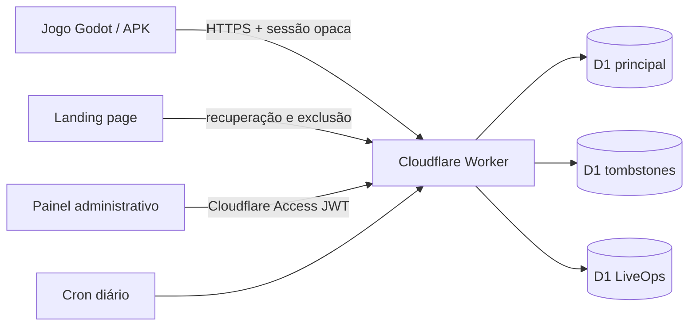

# Mana Idle — Cloud Save API

Backend do Mana Idle para Cloudflare Workers + D1. O ambiente de homologação foi publicado em 16/07/2026; os recursos de produção ainda não foram criados.

O contrato HTTP completo está em [API.md](./API.md).

## Arquitetura



- `DB`: jogadores, aparelhos, sessões, saves, snapshots, carteira gratuita, ações de segurança, configuração operacional e auditoria administrativa.
- `DELETIONS_DB`: registro separado de tombstones. Ele permite reaplicar exclusões se um backup antigo do banco principal for restaurado.
- `LIVEOPS_DB`: balanceamentos e campanhas versionados e imutáveis, estado publicado e auditoria específica.
- Worker: autenticação, validação do save v8, configuração remota, CAS por revisão, idempotência, limites de requisição, CORS, rotinas administrativas e manutenção agendada.
- Cloudflare Access: autenticação do painel administrativo em staging e produção.
- Não há endpoint de compra, pagamento ou saldo pago. `paid_balance` é fixado em zero pelo banco.

## Garantias implementadas

- Sessões e códigos de recuperação são opacos; o banco guarda somente HMACs.
- Save com `ETag`, `If-Match`, revisão monotônica e resposta `412` contendo o estado conflitante.
- Repetição segura de upload, restore e operações da carteira por `mutationId`/`operationId`.
- Limites de 96 KiB para o envelope e 64 KiB para o JSON do save.
- Validação estrutural do save v8, checksum SHA-256 e proteção contra relógio mais de cinco minutos no futuro.
- Código de recuperação com rotação, revogação de outros aparelhos e redefinição atrasada em 24 horas.
- Exclusão imediata com código ou atrasada em sete dias; tombstone separado com reconciliação automática.
- Sessão web de exclusão restrita, com validade de 15 minutos.
- Carteira exclusivamente gratuita, migração única e limitada, bônus diário e catálogo definido no servidor.
- Admin sem editor SQL, sem leitura do conteúdo do save e sem edição arbitrária de gemas.
- LiveOps com versões imutáveis, publicação/rollback por `If-Match`, motivos obrigatórios e histórico efetivo de 15 dias para cálculo offline.
- Multiplicadores normalizados e limitados no servidor e no jogo; configuração remota só contém campos conhecidos, nunca código executável.
- Logs estruturados sem token, código de recuperação, payload do save, IP ou identificador bruto do jogador.

## Requisitos locais

- Node.js 22 ou mais recente.
- npm.

Instalação:

```powershell
npm ci
Copy-Item .dev.vars.example .dev.vars
```

Edite `.dev.vars` e substitua todos os valores `dev-only-*`. Gere um valor diferente para cada pepper e para o token administrativo local. Um comando possível para gerar cada valor é:

```powershell
node -e "console.log(require('node:crypto').randomBytes(48).toString('base64url'))"
```

Nunca reutilize valores locais em staging ou produção. `.dev.vars` é ignorado pelo Git.

Prepare os três bancos locais:

```powershell
npm run db:migrate:local
npm run db:migrate:local:deletions
npm run db:migrate:local:liveops
```

Inicie o Worker:

```powershell
npm run dev
```

Por padrão, a API fica no endereço exibido pelo Wrangler, normalmente `http://localhost:8787`.

## Verificação

```powershell
npm run check
npm run build:dry
npm audit --omit=dev
```

`npm run check` valida os tipos gerados pelo Wrangler, TypeScript, ESLint e a suíte Vitest/Miniflare com D1 real local. O build seco empacota o Worker sem publicar.

Scripts disponíveis:

| Comando | Função |
| --- | --- |
| `npm run dev` | Worker local persistido em `.wrangler/state` |
| `npm run types` | Regenera `worker-configuration.d.ts` |
| `npm run typecheck` | Verifica Worker e testes |
| `npm run lint` | Executa regras estritas de qualidade |
| `npm test` | Executa os testes locais com D1 |
| `npm run check` | Executa toda a validação |
| `npm run build:dry` | Gera o bundle sem deploy |
| `npm run db:migrate:local:liveops` | Prepara o D1 LiveOps local |

## Migrações

As migrações são somente aditivas e ficam separadas por banco:

- `migrations/main`: identidade, cloud save, idempotência, snapshots, segurança, admin e carteira gratuita.
- `migrations/deletions`: tombstones de exclusão.
- `migrations/liveops`: balanceamento, campanhas, versões imutáveis, estado e auditoria LiveOps.

Não altere uma migração já aplicada remotamente. Crie uma nova migração numerada e teste primeiro no banco local correspondente.

## Homologação Cloudflare

- Worker: `mana-save-staging`
- URL: `https://mana-save-staging.spankk-bolter.workers.dev`
- D1 principal: `mana-save-staging`, com quatro migrações aplicadas
- D1 de tombstones: `mana-delete-staging`, com uma migração aplicada
- D1 de LiveOps: `mana-liveops-staging`, com uma migração aplicada e baseline `balance-baseline-v1`
- Secrets: `TOKEN_PEPPER_V1`, `TOKEN_PEPPER_V2`, `RECOVERY_PEPPER_V1`, `RECOVERY_PEPPER_V2` e `DELETION_PEPPER_V1`
- Cron: diariamente às `03:15 UTC`

Os peppers foram gerados em memória e cadastrados como Worker secrets; seus valores não foram gravados no repositório. `DEV_ADMIN_TOKEN` não foi configurado remotamente. O endpoint `/health`, o status operacional, CORS e o schema dos três bancos foram verificados após o deploy.

O endpoint público `GET /v1/config` está ativo, com ETag fraco, `X-Server-Now`, revalidação e CORS restrito à landing. O Cloudflare Access ainda é o bloqueio do painel administrativo. Até `ACCESS_TEAM_DOMAIN` e `ACCESS_AUD` receberem valores reais, as rotas retornam `403 ADMIN_ACCESS_REQUIRED` sem JWT e `503 ADMIN_ACCESS_NOT_CONFIGURED` com um header de teste.

## Produção ainda não criada

Antes de criar ou publicar qualquer recurso de produção, confirme os domínios finais, o e-mail público, a política/administradores do Access e a estratégia de secrets. Produção deve usar três D1 novos e peppers diferentes dos de homologação. Não reutilize os IDs de staging nem execute `wrangler deploy --env production` enquanto esses dados não estiverem definidos.

## Operação e recuperação

- O cron roda diariamente às `03:15 UTC` e reconcilia exclusões, ações atrasadas, sessões expiradas, contas vazias abandonadas, idempotência antiga e retenção de snapshots.
- Uma restauração do banco principal deve ser seguida imediatamente por `POST /v1/admin/deletions/reconcile`. O tombstone separado remove novamente qualquer conta que já havia sido excluída.
- Não restaure o banco principal por cima do banco de tombstones.
- A retenção do tombstone é 45 dias. Ela deve continuar maior que a maior janela de backup/restauração adotada.
- O admin pode ativar manutenção, bloquear uploads, bloquear novas contas e definir a versão mínima do cliente sem novo deploy.
- O admin LiveOps cria rascunhos, publica, cancela ou faz rollback com concorrência otimista e trilha de auditoria; jogadores recebem a mudança sem novo APK.
- Campanhas preservam a janela realmente publicada: uma alteração ou cancelamento nunca reescreve retroativamente o ganho offline já ocorrido.

## Rotação de peppers

O código aceita versões V1 e V2:

1. Cadastre os secrets V2 mantendo `CURRENT_TOKEN_KEY_VERSION` e `CURRENT_RECOVERY_KEY_VERSION` em `1`.
2. Altere os campos `CURRENT_*` para `2` e publique.
3. Novas credenciais passarão a usar `S2`/`R2`; as antigas continuam verificáveis com V1.

Não remova `RECOVERY_PEPPER_V1` enquanto existir qualquer código R1 válido. Códigos de recuperação não expiram automaticamente. `DELETION_PEPPER_V1` também não pode ser trocado sem uma migração específica, porque liga o banco principal aos tombstones.

## Custos e pagamentos

O projeto usa somente Workers, D1, observabilidade, Access e hospedagem web da Cloudflare. O consumo inicial pode caber nas franquias disponíveis, mas limites e preços devem ser conferidos no painel no momento do deploy. Não há integração financeira antes da publicação na Google Play; a carteira atual concede e consome apenas gemas gratuitas.
